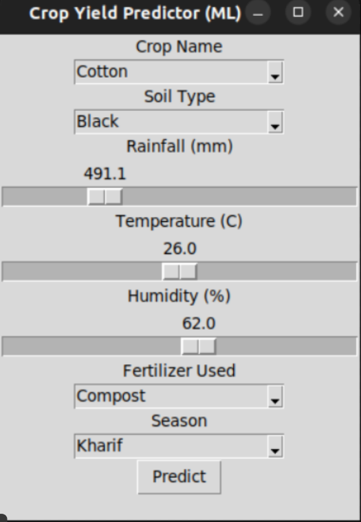

# Crop Yield Prediction using Machine Learning

## Overview

This project predicts agricultural crop yield using environmental and soil-related factors.
It combines data preprocessing, machine learning model training, and a desktop GUI application to provide real-time yield predictions based on user inputs.

The goal is to simulate how data-driven approaches can assist in agricultural decision-making.

---

## Features

* Preprocessing for mixed numeric and categorical data
* Random Forest regression model
* Model persistence using joblib
* Desktop GUI built with tkinter
* Cross-platform setup (Linux & Windows)

---

## Technologies Used

* Python 3.10+
* pandas
* numpy
* scikit-learn
* joblib
* tkinter

---
## GUI Preview



## Project Structure

```
crop_yield_prediction/
├── data/
│   └── crop_yield.csv
├── models/
│   └── crop_model.pkl
├── src/
│   ├── config.py
│   ├── preprocess.py
│   ├── train.py
│   └── predict.py
├── gui/
│   └── app.py
├── requirements.txt
├── setup.sh
├── setup_windows.bat
└── README.md
```

---

## Dataset Schema

CSV file: `data/crop_yield.csv`

Required columns:

* `crop_name` (categorical)
* `soil_type` (categorical)
* `rainfall` (numeric)
* `temperature` (numeric)
* `humidity` (numeric)
* `fertilizer_used` (categorical)
* `season` (categorical)
* `yield` (numeric target variable)

---

## Workflow

1. Load dataset from CSV file
2. Preprocess categorical and numeric features
3. Train Random Forest regression model
4. Evaluate model performance
5. Save trained model to `models/crop_model.pkl`
6. Use GUI to input parameters and predict yield

---

## Model Details

* Algorithm: Random Forest Regressor
* Suitable for nonlinear relationships between environmental factors and crop yield
* Handles mixed feature types after preprocessing
* Model saved using joblib for later inference

---

## Performance Metrics

Example evaluation metrics:

* RMSE: (Add your value here)
* R² Score: (Add your value here)

---

## Linux Setup

```
cd crop_yield_prediction
chmod +x setup.sh
./setup.sh
source venv/bin/activate
python gui/app.py
```

---

## Windows Setup

Open Command Prompt inside `crop_yield_prediction`:

```
setup_windows.bat
venv\Scripts\activate
python gui\app.py
```

---

## GUI Inputs

* Dropdown menus:

  * crop_name
  * soil_type
  * fertilizer_used
  * season

* Sliders:

  * rainfall
  * temperature
  * humidity

---

## Future Improvements

* Integration with real-time weather APIs
* Model comparison (Linear Regression, XGBoost)
* Feature importance visualization
* Web-based deployment

---

